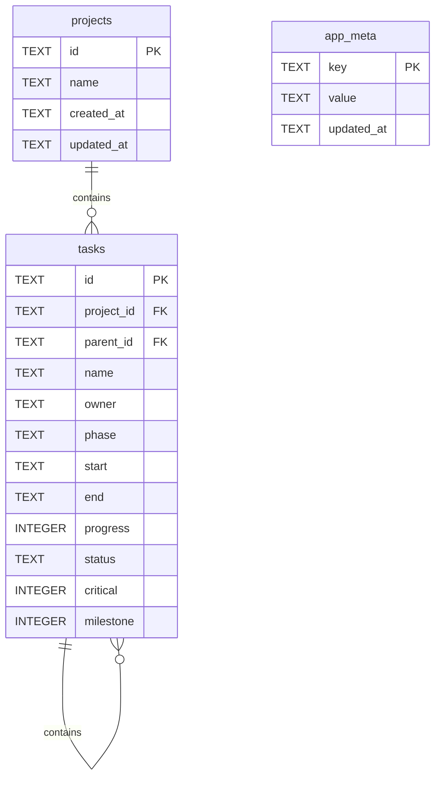

# Database Schema

This project stores data in a SQLite database at:

```text
data/pm-tools.sqlite
```

The database is initialized in `server.js` with Node's built-in `node:sqlite` module.

## Entity Relationship



## Table: `projects`

| Column | Type | Required | Default | Description |
| --- | --- | --- | --- | --- |
| `id` | `TEXT` | Yes | None | Primary key. Generated with `randomUUID()` when a project is created. |
| `name` | `TEXT` | Yes | None | Project name. |
| `created_at` | `TEXT` | Yes | None | Project creation timestamp, stored as an ISO string. |
| `updated_at` | `TEXT` | Yes | None | Last project update timestamp, stored as an ISO string. |

## Table: `tasks`

| Column | Type | Required | Default | Description |
| --- | --- | --- | --- | --- |
| `id` | `TEXT` | Yes | None | Primary key. Generated with `randomUUID()` when a task is created. |
| `project_id` | `TEXT` | Yes | None | Foreign key pointing to `projects.id`. |
| `parent_id` | `TEXT` | No | `NULL` | Optional self-reference pointing to the parent `tasks.id` for subtasks. |
| `name` | `TEXT` | Yes | None | Task name. |
| `owner` | `TEXT` | Yes | None | Person responsible for the task. |
| `phase` | `TEXT` | Yes | None | Project phase for the task. |
| `start` | `TEXT` | Yes | None | Task start date in `YYYY-MM-DD` format. |
| `end` | `TEXT` | Yes | None | Task end date in `YYYY-MM-DD` format. |
| `progress` | `INTEGER` | Yes | `0` | Task progress from `0` to `100`. |
| `status` | `TEXT` | Yes | None | Task status. Current app values are `未开始`, `进行中`, `已完成`, and `风险`. |
| `critical` | `INTEGER` | Yes | `0` | Boolean-like flag. `1` means critical task, `0` means not critical. |
| `milestone` | `INTEGER` | Yes | `0` | Boolean-like flag. `1` means milestone, `0` means not milestone. |

## Table: `app_meta`

| Column | Type | Required | Default | Description |
| --- | --- | --- | --- | --- |
| `key` | `TEXT` | Yes | None | Primary key for metadata values. |
| `value` | `TEXT` | Yes | None | Metadata value. |
| `updated_at` | `TEXT` | Yes | None | Last metadata update timestamp, stored as an ISO string. |

Current V3 metadata keys:

| Key | Description |
| --- | --- |
| `schema_version` | Current database schema version. V3 stores this as `3`. |
| `last_backup_file` | Most recent automatic pre-upgrade backup path. |

## Constraints And Indexes

| Type | Name | Definition |
| --- | --- | --- |
| Primary key | `projects.id` | Each project has one unique ID. |
| Primary key | `tasks.id` | Each task has one unique ID. |
| Primary key | `app_meta.key` | Each metadata key is unique. |
| Foreign key | `tasks.project_id -> projects.id` | Each task belongs to one project. |
| Foreign key | `tasks.parent_id -> tasks.id` | Subtasks can be associated with a parent task. |
| Cascade delete | `ON DELETE CASCADE` | Deleting a project deletes its tasks. |
| Index | `idx_tasks_project_id` | Speeds up task lookup by project ID. |
| Index | `idx_tasks_parent_id` | Speeds up subtask lookup by parent task ID. |

## Initialization Behavior

On startup, `server.js` runs `CREATE TABLE IF NOT EXISTS` for the core tables. This means normal startup will create missing tables but will not delete existing tables or rows.

V3 records the schema version in `app_meta`. If the current database schema is older than the app schema version, the app first creates a consistent SQLite backup with `VACUUM INTO`, then applies the migration.

The V3 migration adds `tasks.parent_id` and `idx_tasks_parent_id` so each task can own one level of subtasks. The API validates that subtasks point to an existing top-level task in the same project.

Automatic pre-upgrade backups are stored in:

```text
data/backups/
```

If the `projects` table is empty, the app tries to migrate old JSON data from:

```text
data/projects.json
```

If no valid legacy JSON exists, it creates one fallback project.
